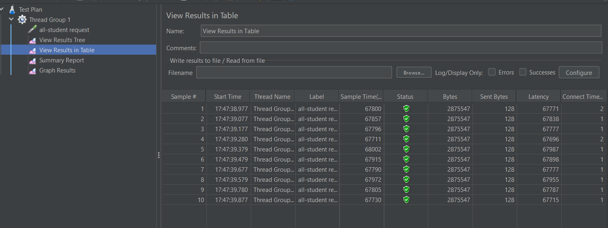
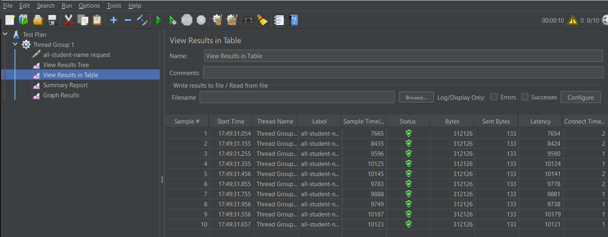
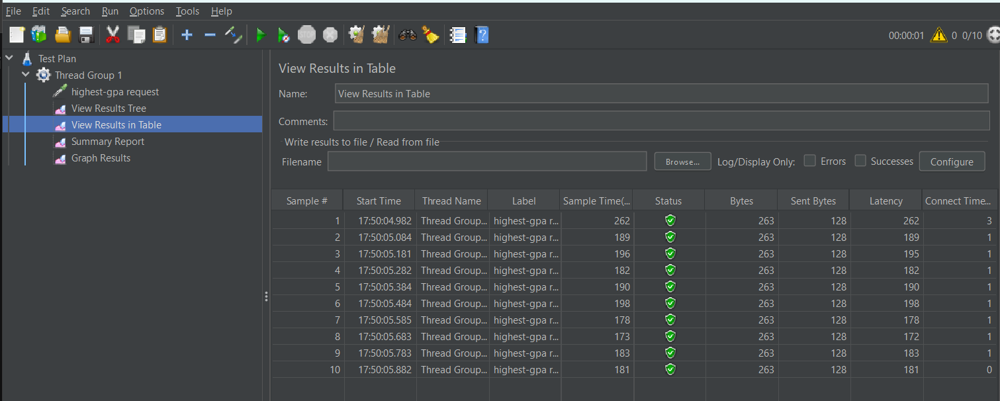
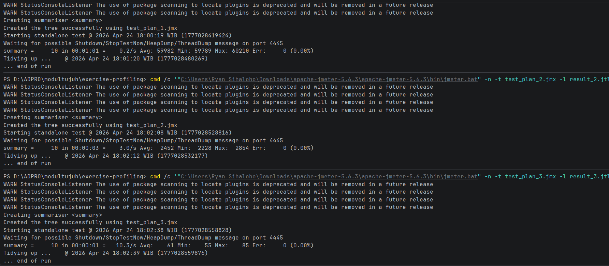
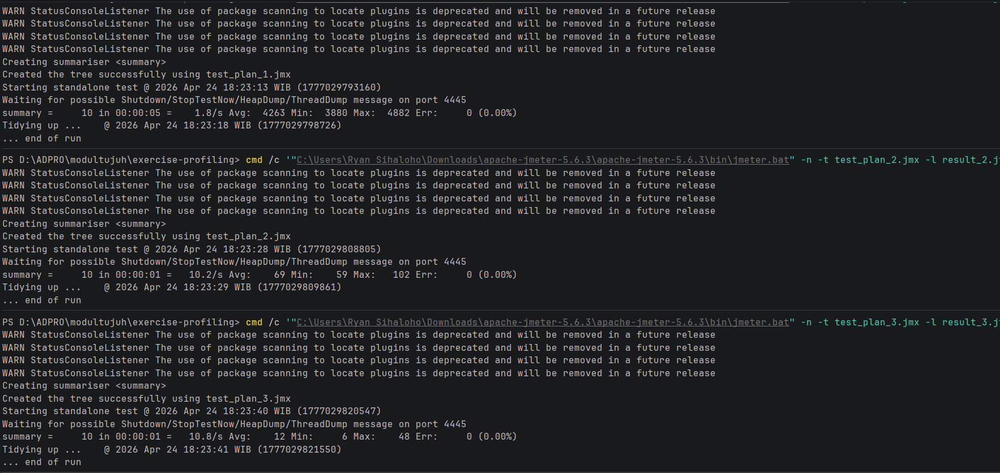

# Tutorial 7: Profiling & Performance Optimization

## 1. Performance Testing (Sebelum Optimasi)

Bagian ini menunjukkan hasil pengujian performa menggunakan Apache JMeter sebelum kode dioptimasi, dengan simulasi 10 *user* (Thread Group).

### Hasil Pengujian melalui GUI (View Results in Table)
- **Endpoint `/all-student`:**
  

- **Endpoint `/all-student-name`:**
  

- **Endpoint `/highest-gpa`:**
  

### Hasil Pengujian melalui CLI (Command Line)
Pengujian melalui CLI (Non-GUI Mode) dilakukan untuk mendapatkan hasil yang lebih akurat tanpa membebani memori sistem.

---

## 2. Profiling & Performance Optimization (Setelah Optimasi)

Setelah mengetahui bahwa aplikasi berjalan lambat, dilakukan *profiling* untuk menemukan *bottleneck* (kelemahan kode). Masalah utama yang ditemukan adalah adanya **N+1 Query Problem** dan konkatenasi `String` di dalam *looping*.

Kode kemudian di- *refactor* (dioptimasi), dan berikut adalah hasil pengujian JMeter via CLI setelah optimasi:

### Kesimpulan dan Perbandingan Hasil
Berdasarkan metrik `Avg` (Rata-rata waktu respons) dari hasil CLI JMeter, berikut adalah perbandingan performa sebelum dan sesudah optimasi:

| Endpoint | Sebelum Optimasi (Avg) | Setelah Optimasi (Avg) | Peningkatan Performa | Keterangan |
| :--- | :--- | :--- | :--- | :--- |
| `/all-student` | 59.982 ms | 4.263 ms | **~ 92,8%** | Menyelesaikan masalah N+1 Query. Mengambil semua relasi secara langsung dari `studentCourseRepository`. |
| `/all-student-name` | 2.452 ms | 69 ms | **~ 97,1%** | Mengganti konkatenasi `+=` di dalam *loop* dengan `Stream API` dan `Collectors.joining`. |
| `/highest-gpa` | 61 ms | 12 ms | **~ 80,3%** | Memindahkan logika pencarian/sorting dari memori Java ke level *Database Query* (`ORDER BY gpa DESC LIMIT 1`). |

**Kesimpulan:** Optimasi kode berhasil meningkatkan performa aplikasi secara drastis (di atas target 20%). Penggunaan *resource* CPU dan RAM menjadi jauh lebih efisien karena kita mendelegasikan tugas berat ke *database* dan menghindari operasi yang boros memori di level aplikasi.

---

## 3. Reflection

**1. What is the difference between the approach of performance testing with JMeter and profiling with IntelliJ Profiler in the context of optimizing application performance?**
- **JMeter (Performance Testing):** Melakukan pendekatan *black-box*. JMeter menguji aplikasi dari luar dengan mensimulasikan banyak *user* yang mengirimkan HTTP *request* secara bersamaan. Tujuannya adalah melihat metrik secara umum seperti *response time* (waktu respons), *throughput*, dan *error rate*.
- **IntelliJ Profiler (Profiling):** Melakukan pendekatan *white-box*. Profiler melihat "ke dalam" mesin aplikasi (JVM) saat aplikasi sedang berjalan. Tujuannya adalah mencari tahu baris kode atau *method* mana yang memakan waktu eksekusi (CPU Time) atau memori (RAM) paling besar.

**2. How does the profiling process help you in identifying and understanding the weak points in your application?**
Proses *profiling* memberikan visualisasi (seperti *Flame Graph* atau *Method List*) yang menunjukkan secara persis berapa milidetik yang dihabiskan oleh setiap *method*. Daripada menebak-nebak bagian kode mana yang lambat, *profiling* memberikan data pasti (fakta) sehingga kita bisa langsung fokus memperbaiki bagian yang menjadi *bottleneck* utama (misalnya method `getAllStudentsWithCourses` yang memakan CPU time terbesar).

**3. Do you think IntelliJ Profiler is effective in assisting you to analyze and identify bottlenecks in your application code?**
Ya, sangat efektif. Dengan fitur *Flame Graph* dan *Call Tree*, saya bisa melihat alur eksekusi aplikasi dari atas ke bawah. Ini sangat membantu untuk mendeteksi operasi tersembunyi yang boros *resource*, seperti kueri *database* yang terpanggil berulang kali di dalam sebuah *looping* (N+1 *query problem*).

**4. What are the main challenges you face when conducting performance testing and profiling, and how do you overcome these challenges?**
- **Tantangan:** Menyiapkan data awal (*seeding*) yang berjumlah besar memakan waktu cukup lama. Selain itu, hasil pengujian pertama kali biasanya tidak stabil karena JVM butuh waktu untuk melakukan *warm-up* (JIT Compilation).
- **Solusi:** Bersabar saat proses *seeding*, dan mengeksekusi *test* JMeter beberapa kali (mengabaikan hasil pertama) agar mendapatkan metrik yang stabil dan lebih representatif terhadap kondisi aslinya.

**5. What are the main benefits you gain from using IntelliJ Profiler for profiling your application code?**
Manfaat utamanya adalah menghemat waktu *debugging*. Profiler menghilangkan faktor tebak-tebakan. Saya mendapat bukti metrik yang akurat mengenai performa kode saya, sehingga optimasi yang dilakukan menjadi tepat sasaran. Selain itu, saya jadi belajar pola kodingan mana yang buruk untuk performa (seperti konkatenasi String di dalam *loop*).

**6. How do you handle situations where the results from profiling with IntelliJ Profiler are not entirely consistent with findings from performance testing using JMeter?**
Jika hal ini terjadi (misal: JMeter menunjukkan *response time* lambat, tapi CPU Time di Profiler sangat singkat), saya akan mencari masalah di luar kode aplikasi (*external factors*). Lambatnya aplikasi bisa jadi disebabkan oleh latensi jaringan (*network delay*), keterbatasan *Connection Pool* ke *database*, atau proses *Garbage Collection* di JVM. Saya akan memperlebar cakupan pemantauan, tidak hanya melihat *method execution time*.

**7. What strategies do you implement in optimizing application code after analyzing results from performance testing and profiling? How do you ensure the changes you make do not affect the application's functionality?**
- **Strategi Optimasi:**
    1. Mendelegasikan pemrosesan data (seperti *sorting* atau *filtering*) ke *database query*, bukan menarik semua data lalu memprosesnya di memori Java.
    2. Mencegah pemanggilan *database* di dalam *looping* untuk mengatasi N+1 Query.
    3. Menggunakan struktur data yang lebih efisien (misal: menggunakan `StringBuilder` atau `Stream API` alih-alih `+=` untuk String).
- **Menjaga Fungsionalitas:** Sebelum melakukan optimasi, saya harus memahami *output* yang diharapkan dari *method* tersebut. Untuk proyek berskala nyata, cara paling aman adalah dengan menulis dan menjalankan **Unit Test** serta **Integration Test** sebelum dan sesudah *refactoring* untuk memastikan hasil akhir (*return value*) tidak berubah.